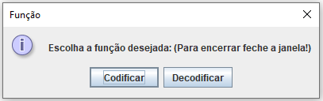

# Tratamento de Ruídos - Hamming

## Trabalho do Grau A de Teoria da Informação - Unisinos

### Membros do Grupo:

👩‍🎓 Karolina Pacheco

👩‍🎓 Nadine Schneider

👨‍🎓 Tiago Costa

👨‍🎓 Rafael Stefani Baptista

---

### HOW TO RUN

Para rodar a implementação feita pelo grupo, basta rodar a classe **Main**. 

A partir dai, um menu aparecerá na tela, como abaixo:

Ao escolher a opção **Codificar** será adicionado o tratamento de ruído e um arquivo .ecc será gerado. Nesta opção, apenas arquivos .cod podem ser selecionados.

A implementação de tratamento de ruído feita pelo grupo adiciona o CRC-8 dos dois primeiros bytes do arquivo .cod e também os codewords Hamming do restante do aqruivo .cod. O arquivo .ecc contém o CRC calculado no 3º byte e os codewords Hamming a seguir.
 
Se a opção **Decodificar** for selecionada, será possível apenas selecionar arquivos .ecc e então em cima dele é feita a verificação do tratamento de ruídos.

---

### Informações da Implementação

O tratamento de ruído tem a seguinte estrutura:

- Classe **TratamentoRuido** com dois métodos principais:
   - addNoiseTreatment: adiciona informações de tratamento de ruído, que são o CRC8 e Hamming. Chamado quando a opção codificação no menu é selecionada.
   - checkNoiseTreatment: verifica se há problema nas informações codificadas do arquivo .ecc e informa o usuário, sendo por meio de interrupção do processo caso haja problema no CRC8 ou somente logando e ajustando problemas encontrados no Hamming. Além disso, remove a informação adicionada anteriormente pelo **addNoiseTreatment**, dessa forma tem-se o arquivo .cod original. Chamado quando a opção decodificação no menu é selecionada.

* CRC 8

   O CRC8 é calculado utilizando os 2 primeiros bytes do arquivo, referentes ao cabeçalho. Para cálculo do CRC8 foi utilizado um código pronto encontrado pelo grupo em pesquisas na internet, sua referência pode ser encontrada ao final deste Readme. A classe que faz esse cálculo é a **CRC8**.
   
   Foi realizada apenas uma modificação no código: no método **calc** foi removido o parametro de entrada **len** que se refere ao tamanho do vetor recebido. Isto foi feito pois o tamanho do vetor pode ser acessado por **data.length**.
   
   Caso na decodificação os valor de CRC8 calculados sejam diferentes, então uma exceção é jogada, para interromper o processo. Esta exceção é a da classe **InvalidCRC**.
   
* Hamming

   Os códigos Hamming são calculados para o restante dos bytes do arquivo de entrada (.cod). A codificação e decodificação Hamming encontram-se na classe **Hamming**.
   
   Foi utilizada a estrutura [BitSet](https://docs.oracle.com/javase/7/docs/api/java/util/BitSet.html) do Java para fácil acesso aos bits para realização da codificação quanto da verificação de erros na decodificação.

---

### Objetivo do T2:

Neste trabalho deve ser acrescentado ao cenário do T1 técnicas de tratamento de ruído (códigos de correção de erro - ECC). Essa funcionalidade pode ser acrescentada de maneira separada/independente ou acrescida/integrada às implementações do encoder e do decoder. A figura a seguir apresenta esta nova etapa no processo, que fica após a codificação do arquivo original e antes da decodificação do mesmo.

Depois do arquivo ter sido codificado, ele é recodificado ganhando informação adicional para tratamento de ruído. Devem ser implementadas duas técnicas:

- Logo após o cabeçalho do arquivo, deve ser acrescentado/gravado um byte resultante do cálculo CRC-8 (ATM) dos dois bytes do cabeçalho;
- Depois disso serão armazenados os codewords Hamming formados a partir da leitura da informação dos codewords presentes no arquivo codificado. Por exemplo: a cada 4 bits dos codewords do arquivo codificado alice29.cod é gerado um codeword Hamming de 7 bits que será armazenado no arquivo alice29.ecc

Em função do uso de codificação Hamming o tamanho do arquivo com ECC é maior que o do arquivo codificado.
Caso haja necessidade pode ser acrescentada informação adicional ao arquivo codificado (por ex., o valor do tamanho em bytes do arquivo original).

### **Tratamento dos erros:**

No caso de ocorrência de erro no processo de decodificação do arquivo com ECC, deve ser apresentado para o usuário (ou gravado em um arquivo de log) as informações pertinentes ao erro. São dois os tipos de erro tratados:

- o erro pode ter sido detectado na decodificação de uma palavra Hamming, e nesse caso o erro deve ser corrigido mas o evento deve ser notificado ao usuário (ou anotado no log);
- o erro pode ser detectado na checagem/verificação do CRC do cabeçalho (em função de alguma alteração sofrida nos 2 primeiros bytes do arquivo codificado); nesse caso o usuário é avisado mas não há correção a ser realizada - nesta situação, o ideal é impedir o processo de decodificação do arquivo codificado, pois a meta informação (o cabeçalho) foi corrompido.

### 🔎 **Observações finais:**

Devem ser entregues/postados:

- o código executável e o código fonte (ou a URL onde estes se encontram disponíveis)
- a documentação básica da implementação juntamente com um README com orientações para instalação e execução do protótipo, além de comentários sobre limitações deste e outras observações julgadas pertinentes. Também deve constar deste documento as referências a todas bibliotecas/módulos/pacotes de terceiros empregadas no protótipo. Modificações realizadas nos algoritmos também devem estar descritas neste documento
- O código pode também ser disponibilizado via github, bitbucket, etc., assim como a aplicação pode estar hospedada online.

<h4>Referências</h4>

CRC-8 - https://github.com/drogatkin/JustFLAC/blob/master/src/java/org/kc7bfi/jflac/util/CRC8.java

