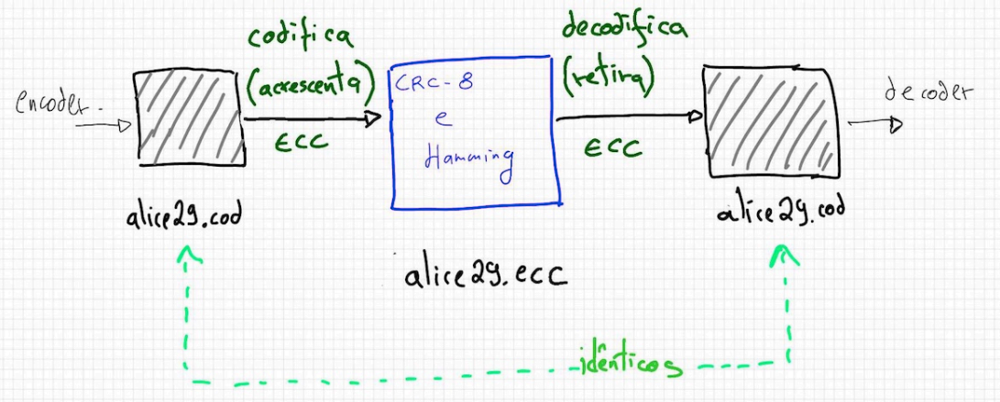
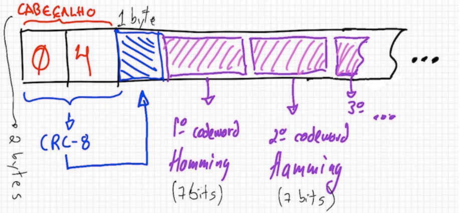

# Tratamento de Ruídos - Hamming

## Trabalho do Grau A de Teoria da Informação - Unisinos

---

### Membros do Grupo:

👩‍🎓 Karolina Pacheco

👩‍🎓 Nadine Schneider

👨‍🎓 Tiago Costa

👨‍🎓 Rafael Stefani Baptista

---

### Objetivo do T2:

Neste trabalho deve ser acrescentado ao cenário do T1 técnicas de tratamento de ruído (códigos de correção de erro - ECC). Essa funcionalidade pode ser acrescentada de maneira separada/independente ou acrescida/integrada às implementações do encoder e do decoder. A figura a seguir apresenta esta nova etapa no processo, que fica após a codificação do arquivo original e antes da decodificação do mesmo.

Depois do arquivo ter sido codificado, ele é recodificado ganhando informação adicional para tratamento de ruído. Devem ser implementadas duas técnicas:

- Logo após o cabeçalho do arquivo, deve ser acrescentado/gravado um byte resultante do cálculo CRC-8 (ATM) dos dois bytes do cabeçalho;
- Depois disso serão armazenados os codewords Hamming formados a partir da leitura da informação dos codewords presentes no arquivo codificado. Por exemplo: a cada 4 bits dos codewords do arquivo codificado alice29.cod é gerado um codeword Hamming de 7 bits que será armazenado no arquivo alice29.ecc

Em função do uso de codificação Hamming o tamanho do arquivo com ECC é maior que o do arquivo codificado.
Caso haja necessidade pode ser acrescentada informação adicional ao arquivo codificado (por ex., o valor do tamanho em bytes do arquivo original).

### **Tratamento dos erros:**

No caso de ocorrência de erro no processo de decodificação do arquivo com ECC, deve ser apresentado para o usuário (ou gravado em um arquivo de log) as informações pertinentes ao erro. São dois os tipos de erro tratados:

- o erro pode ter sido detectado na decodificação de uma palavra Hamming, e nesse caso o erro deve ser corrigido mas o evento deve ser notificado ao usuário (ou anotado no log);
- o erro pode ser detectado na checagem/verificação do CRC do cabeçalho (em função de alguma alteração sofrida nos 2 primeiros bytes do arquivo codificado); nesse caso o usuário é avisado mas não há correção a ser realizada - nesta situação, o ideal é impedir o processo de decodificação do arquivo codificado, pois a meta informação (o cabeçalho) foi corrompido.

### 🔎 **Observações finais:**

Devem ser entregues/postados:

- o código executável e o código fonte (ou a URL onde estes se encontram disponíveis)
- a documentação básica da implementação juntamente com um README com orientações para instalação e execução do protótipo, além de comentários sobre limitações deste e outras observações julgadas pertinentes. Também deve constar deste documento as referências a todas bibliotecas/módulos/pacotes de terceiros empregadas no protótipo. Modificações realizadas nos algoritmos também devem estar descritas neste documento
- O código pode também ser disponibilizado via github, bitbucket, etc., assim como a aplicação pode estar hospedada online.